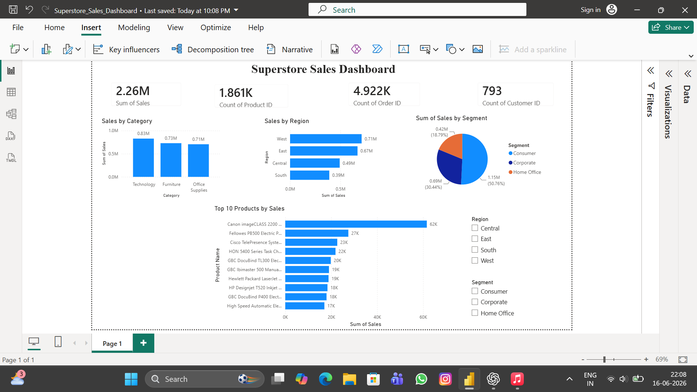

# Superstore Sales Dashboard

## Overview
An interactive Power BI dashboard built using the Superstore Sales dataset to analyze sales performance, customer behavior, regional trends, and product performance.

## Tools Used
- Power BI
- Data Visualization
- Dashboard Design

## Dashboard Features
- Total Sales KPI
- Total Orders KPI
- Total Customers KPI
- Sales by Category
- Sales by Region
- Sales by Segment
- Top 10 Products by Sales
- Interactive Region Filter
- Interactive Segment Filter

## Key Insights
- Technology category generated the highest sales.
- West region recorded the highest revenue.
- Consumer segment contributed the largest share of sales.
- Top-performing products were identified using sales contribution.

## Dashboard Preview

